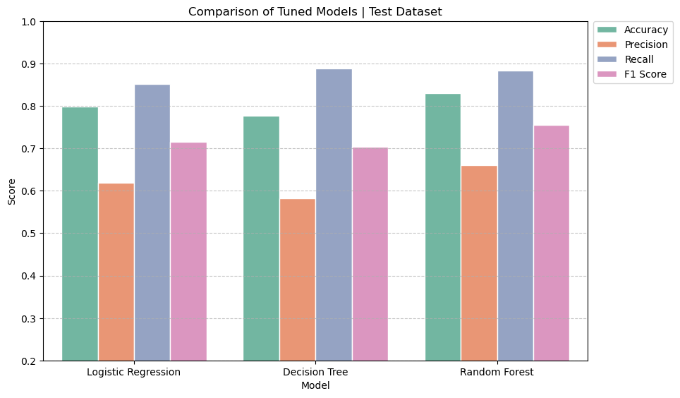

# Lead Conversion Prediction for EdTech Startup


## Executive Summary
ExtraLearn, an innovative EdTech startup, faces the challenge of efficiently managing a rapidly growing pool of leads in the competitive EdTech industry to improve conversion rates and optimize resource allocation. By leveraging machine learning models and data-driven insights, the project focuses on identifying high-potential leads, uncovering key conversion drivers, and optimizing resource allocation to enhance business outcomes.

- **Model Performance**: The Random Forest model delivered the best balance between precision (66.1%) and recall (88.4%), effectively identifying high-potential leads while managing resource efficiency.
- **Key Conversion Drivers**: Time spent on the website and initial interaction through the website emerged as the most significant predictors across all models. Other influential factors included profile completion level, recent activity, and lead age.

**Key Outcomes**
- **Best Model**: Random Forest, with recall (0.884) and accuracy (0.830), achieved the best balance for lead prioritization.
- **Conversion Drivers**: Website engagement time, channel of initial interaction, level of profile completion, and lead demographics were the top predictors.
- **Projected Impact**: Improved resource allocation is expected to reduce acquisition costs (CLP) and significantly boost conversion rate.

**Business Impact**
- **Enhanced Conversion**: Focused on high-potential leads to boost conversion rates.
- **Optimized Strategies**: Tailored marketing and engagement based on actionable insights.

**Actionable Recommendations**
- **Boost Website Engagement**: Enhance user experience with interactive features (live chat, recommendations).
- **Promote Profile Completion**: Use gamification and incentives to drive profile completion and conversions.
- **Focus on Effective Channels**: Prioritize website and email interactions over less efficient channels.
- **Leverage Referral Programs**: Expand referral strategies to capitalize on their high conversion rate (67.7%).
- **Update Model**: Adapt to changing user behavior to ensure sustained performance.

## Table of Contents

- [Introduction](#introduction)
- [Objective](#objective)
- [Key Business Metrics](#key-business-metrics)
- [Exploratory Data Analysis](#exploratory-data-analysis)
- [Machine Learning Models](#machine-learning-models)
- [Data Insights](#data-insights)
- [Models’ Performance](#models-performance)
- [Business Recommendations](#business-recommendations)
- [Conclusion](#conclusion)
- [Repository Structure](#repository-structure)
- [Requirements](#requirements)
- [Installation](#installation)

## Introduction
In the highly competitive EdTech industry, identifying and prioritizing high-potential leads is crucial for boosting conversion rates and optimizing resource allocation. ExtraaLearn, an innovative startup, faces the challenge of managing a rapidly growing pool of leads while ensuring effective allocation of limited resources. To thrive in this dynamic landscape, the company must efficiently distinguish between high-value prospects and lower-priority leads.

This project leverages machine learning to address this challenge by identifying and prioritizing high-potential leads, uncovering key drivers of conversion, and refining marketing and sales strategies. The dataset captures detailed lead interactions across various channels, providing a robust foundation for actionable insights and model development.

## Objective
The primary goal of this project is to build a machine learning framework to improve lead conversion and resource allocation by identifying high-potential leads and understanding key conversion drivers.

**Key Objectives**
1. **Lead Identification**: Apply machine learning models to identify and prioritize leads with high conversion potential.
2. **Conversion Drivers**: Uncover key factors influencing lead conversion to enable data-driven decision-making.
3. **Resource Optimization**: Develop lead profiles and strategies to enhance targeting efforts and streamline resource allocation.

**Machine Learning Models**
1. **Logistic Regression**: Provides a probabilistic framework to predict lead conversion and identify key drivers.
2. **Decision Tree**: Offers interpretable decision paths while capturing non-linear relationships in the data.
3. **Random Forest**: Combines multiple decision trees for robust predictions and reduced overfitting.

## Key Business Metrics
To evaluate model performance and align with business objectives, the following metrics are tracked:

**Predictive Metrics**
- **Accuracy**: Reflects overall model performance in correctly classifying leads. Higher accuracy indicates better general performance.
- **Precision**: Measures the proportion of true positives among all positive predictions, ensuring reliability in identifying converted leads, while reducing false positives.
- **Recall**: Measures the proportion of true positives among all actual conversions, ensuring reliability in capturing potential leads, while reducing false negatives.
- **F1 Score**: Balances precision and recall as the harmonic mean, providing a single metric for performance trade-off.

**Business Key Performance Indicators (KPIs)**
- **Pages per Session**: Measures the average number of pages viewed during a single session, reflecting user engagement on the website.
- **Bounce Rate**: Indicates the percentage of visitors leaving the website without further interaction, highlighting engagement issues.
- **Lead Form Submissions**: Tracks the number of completed forms, providing insights into profile completion progress and lead generation.
- **Qualified Lead Rate (MQLs)**: Represents the percentage of leads meeting predefined marketing-qualified criteria, evaluating channel effectiveness.
- **Unique Visitors**: Measures the number of distinct individuals visiting the website, assessing the reach of targeted campaigns.
- **Cost per Lead (CPL)**: Reflects the average cost of acquiring a lead, ensuring marketing efficiency and alignment with ROI objectives.

## Exploratory Data Analysis
An in-depth exploratory data analysis (EDA) was performed to uncover patterns, detect anomalies, and test hypotheses, providing critical insights that informed the feature selection and modeling strategies.
1. **Data Cleaning and Preprocessing**: Addressed missing values and ensured data integrity for accurate model building.
2. **Descriptive Statistics**: Analyzed lead demographics, engagement metrics, and conversion rates to identify patterns in user behavior and interactions.
3. **Uni/Multivariate Analysis**: Explored individual features and their relationships to uncover key insights on lead conversion and engagement.

## Data Insights
Data-driven insights provided a deeper understanding of lead characteristics, enhancing targeted strategies and informing strategic decision-making in a competitive market.

1. **Demographic Insights**
    - **Current Occupation**: Professionals lead with a 35.5% conversion rate, followed by unemployed individuals at 26.6%, and students at 11.7%. Tailored engagement strategies, particularly for students, can address varying expectations and behaviors.
    - **Age**: Converted leads are typically older, with a median age of 54 compared to 49 for non-converted leads, highlighting the potential of targeting older demographics. The overall age range is 18 to 63 years, with an overall median of 51.

2. **Behavioral Engagement**
    - **Time Spent**: Converted leads spend significantly more time on the website (median: ~13 minutes) compared to non-converted leads (median: ~5 minutes), reinforcing the correlation between extended browsing and conversion likelihood.
    - **First Interaction**: Leads interacting through the website convert at 45.6%, far outperforming mobile app interactions (10.5%), underlining the website’s superior engagement potential.
    - **Last Activity**: Website-related activities drive the highest conversion rate at 38.5%, followed by email at 30.3%, while phone interactions trail at 21.3%. Prioritizing website engagement is key to enhancing conversions.
    - **Profile Completion**: Conversion rates increase with profile completion, from 7.5% (low completion) to 18.9% (medium) and 41.8% (high). Encouraging detailed profile completion presents a clear opportunity to boost conversion rates.

3. **Lead Channels**
    - **Referrals**: Despite their high conversation rate of 67.7%, referrals contribute minimally to total conversions, highlighting an underutilized opportunity. 
    - **Marketing Channels**: Other marketing channels such as print media, digital media, and educational channels show modest performance, with conversion rates between 28% and 33%. These channels contribute a larger number of conversions due to their broader reach but are less efficient compared to referrals.

## Models’ Performance

| Model                | Accuracy | Precision | Recall | F1 Score |
|----------------------|----------|-----------|--------|----------|
| Logistic Regression  | 0.798    | 0.618     | 0.852  | 0.716    |
| Decision Tree        | 0.777    | 0.583     | 0.889  | 0.704    |
| Random Forest        | 0.830    | 0.661     | 0.884  | 0.756    |

All machine learning models demonstrated strong performance in recall, effectively capturing a high percentage of actual conversions. However, they differ significantly in precision and overall balance, with some models offering more well-rounded metrics that better align with the business objective of optimizing lead identification and resource allocation.

1. **Logistic Regression**: Demonstrates strong recall (0.852), capturing 85.2% of actual conversions, making it effective for identifying high-potential leads. However, the lower precision (0.618) indicates that 38.2% of leads predicted to convert do not, potentially leading to inefficient resource allocation.

2. **Decision Tree**: Achieves the highest recall (0.889), identifying 88.9% of actual conversions, but has the lowest precision (0.583), meaning 41.7% of predicted conversions are incorrect. This high false positive rate could strain resources.

3. **Random Forest**: Delivers the best balance with the highest accuracy (0.830) and precision (0.661). Its recall (0.884) is competitive, closely matching the Decision Tree’s recall, with only a slight difference in their ability to capture actual conversions. This balance makes it effective for optimizing lead identification while managing resource efficiency.

<div style="display: flex; gap: 10px;">
    <div style="width: 49%;">
        
        <p><b>Figure 1:</b> Model Performance Comparison.</p>
    </div>
    <div style="width: 49%;">
        
        <p><b>Figure 2:</b> Random Forest Feature Importance.</p>
    </div>
</div>

### Key Takeaways
- ★ **Key Drivers of Conversion**: Across all models, website engagement time and initial interaction through the website emerged as key predictors, highlighting the importance of sustained engagement and effective first touchpoints. Tree-based models also identified profile completion, recent activity, and age as significant factors in driving conversions.

- 🏆 **Best Model**: The random forest model, with a recall of 0.884 and precision of 0.661, offers the best overall balance for lead prioritization, optimizing resource allocation with a lower false positive rate.

- ⚠️ **Performance Trade-Off**: The decision tree, while offering higher recall (0.889), presents a higher false positive rate, making it less efficient for resource optimization compared to random forest.

## Business Recommendations
This set of recommendations focuses on improving lead prioritization, refining user interactions, and leveraging data-driven insights to maximize conversions and business outcomes.

1. **Enhance Website Engagement**
    - **Improve User Experience**: Encourage longer visits and more page views.
    - **Optimize Website Performance**: Simplify navigation and ensure mobile responsiveness and fast-loading pages for seamless engagement.
    - **Introduce Interactive Features**: Implement live chat and personalized recommendations to boost engagement.
    - **Track Engagement Metrics**: Use Pages per Session and Bounce Rate to measure user engagement and identify areas for improvement.
2. **Optimize Interaction Channels**
    - **Prioritize Website and Email**: Focus on interaction methods with higher conversion rates—website activities (38.5%) and email communications (30.3%). 
    - **Enhance Mobile App**: Address low conversion rates (10.5%) by enhancing app functionality and engagement strategies.
    - **Personalize Phone Outreach**: Reserve phone interactions for high-value leads to optimize resources.
    - **Evaluate Channel Effectiveness**: Use Marketing Qualified Lead Rate (MQLs) to assess and refine strategies.
3. **Promote Profile Completion**
    - **Incentivize Completion**: Use gamification, progress indicators, or rewards to motivate users.
    - **Simplify Process**: Reduce required fields and communicate how a complete profile enhances user experience.
    - **Monitor Progress**: Track Lead Form Submissions to gauge profile completion rates.
4. **Targeted Marketing**
    - **Customize Campaigns**: Tailor marketing efforts for professionals and unemployed individuals using platforms like LinkedIn and professional networks to maximize relevance. Offer discounts, flexible payment plans, or course bundles to address lower conversion rates of students.
    - **Leverage Demographics**: Use demographic insights to develop resonant messaging for different audience segments.
    - **Reallocate Resources**: Identify and shift resources from less efficient channels (print, digital media, and educational platforms) to platforms with greater potential for high-quality leads and improved ROI.
    - **Measure Impact**: Analyze traffic and engagement from targeted segments using the Unique Visitors metric.
5. **Leverage Referral Programs**
    - **Expand Programs**: Capitalize on high conversion rates (67.7%) of referrals through broader outreach.
    - **Encourage Sharing**: Use social media, email campaigns, and incentives to promote referrals across platforms.
    - **Track Success**: Monitor Lead Form Submissions from referrals to assess program effectiveness.
6. **Continuous Model Improvement**
    - **Maintain Performance**: Regularly update models to adapt to changing behaviors and refine lead strategies.
    - **Align Design**: Tailor the model to meet business objectives and optimize resource allocation.
    - **Monitor ROI**: Keep Cost per Lead (CPL) in check to align with return on investment (ROI) objectives.

## Conclusion

By leveraging machine learning models and data-driven insights, ExtraaLearn can effectively identify and prioritize high-potential leads, enhancing conversion rates and optimizing resource allocation. The random forest model, with its balanced performance, serves as a valuable tool for lead prioritization. Implementing the outlined recommendations will enable ExtraaLearn to improve engagement strategies, refine marketing efforts, and drive business growth in the competitive EdTech industry.

## Repository Structure
```
├── LICENSE            <- Project's open-source license details.
├── README.md          <- Top-level README for developers.
│
├── requirements.txt   <- Python dependencies for replicating the environment.
├── environment.yml    <- Conda environment configuration with dependencies.
│
├── data
│   ├── processed      <- The final, processed data sets for modeling.
│   └── raw            <- The original, immutable data.
│
├── models             <- The final, trained and tuned classification model.
│
├── notebooks          <- Jupyter notebooks for data exploration and analysis.
│
├── references         <- Documentation, data dictionaries, and manuals.
│
├── reports            <- Generated analysis as HTML, PDF, LaTeX, etc.
│   └── figures        <- Graphics and figures for reports.
│
├── src                <- Source code for the project.
```

## Requirements

`Python 3.11.6` or higher is required. Download the latest version here: [python.org](https://www.python.org)

## Installation

#### 1. Clone the Repository

```bash
git clone https://github.com/tmoesl/lead-conversion-prediction.git
```

#### 2. Navigate to the Project Directory
```bash
cd lead-conversion-prediction
```

#### 3. Create a Virtual Environment and Install the Required Dependencies

Using `conda`:
```bash
conda env create -f environment.yml
conda activate lead-conversion-prediction-env
```

Using `venv`:
```bash
python3.12.3 -m venv lead-conversion-prediction-env
source lead-conversion-prediction-env/bin/activate  # On Windows: .\lead-conversion-prediction-env\Scripts\activate
pip install -r requirements.txt
```
---